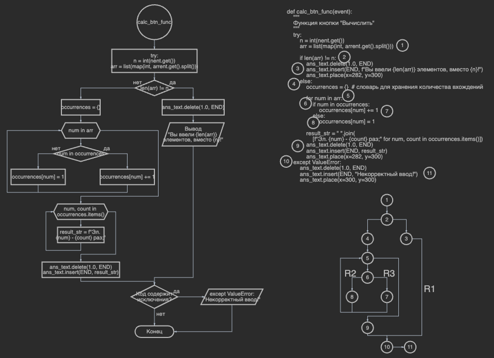

# Лабораторная работа 2 ПТПМ

**Тестирование программ методом “белого ящика”**

___

**Часть 1.**

**Цель работы:** разработать программу для решения задачи 1-ой части, а также протестировать их методом «белого ящика».

1.
Даны числа a₁, b₁, c₁, a₂, b₂, c₂. Напечатать координаты точки пересечения прямых, описываемых уравнениями a₁x+b₁y=c₁ и 
a₂x+b₂y=c₂, либо сообщить, что эти прямые совпадают, не пересекаются или вовсе не существуют.

2.

3.
Мною был выбран метод «белого ящика», т. к. он предоставляет детальное понимание структуры кода, что позволяет 
эффективно выявить потенциальные ошибки и обеспечить полное покрытие функционала.

4.
Пути алгоритма, которые должны быть проверены тестами: A, BCH, BCG, BDEH, BDFH.

5.
Тесты, которые позволят пройти по путям алгоритма: [q, w, e, r, t, y], [1, 1, 1, 1, 1, 1], [0, 0, 0, 0, 0, 0], 
[1, 2, 2, 1, 2, 1], [1, 2, 3, 4, 5, 6].

6.
| Тест                               | Путь | Ожидаемый результат                                   | Фактический результат                                 | Результат тестирования |
|------------------------------------|------|-------------------------------------------------------|-------------------------------------------------------|:----------------------:|
| a₁=q, b₁=w, c₁=e, a₂=r, b₂=t, c₂=y | A    | Некорректный ввод!                                    | Некорректный ввод!                                    |  Ошибка не обнаружена  |
| a₁=1, b₁=1, c₁=1, a₂=1, b₂=1, c₂=1 | BDFH | Прямые совпадают                                      | Прямые совпадают                                      |  Ошибка не обнаружена  |
| a₁=0, b₁=0, c₁=0, a₂=0, b₂=0, c₂=0 | BCG  | Деление на ноль! Прямые параллельны и не пересекаются | Деление на ноль! Прямые параллельны и не пересекаются |  Ошибка не обнаружена  |
| a₁=1, b₁=2, c₁=2, a₂=1, b₂=2, c₂=1 | BDEH | Прямые параллельны и не пересекаются                  | Прямые параллельны и не пересекаются                  |  Ошибка не обнаружена  |
| a₁=1, b₁=2, c₁=3, a₂=4, b₂=5, c₂=6 | BCH  | -1.0, 2.0                                             | -1.0, 2.0                                             |  Ошибка не обнаружена  |

**Вывод:** после тестирования мною разработанной программы можно заявить, что ошибок обнаружено не было, т. к. ещё на 
стадии написании кода были учтены все возможные ошибки и исключения.

**Контрольные вопросы:**
- Какие подходы к тестированию программ Вы знаете? В чем разница этих подходов?
  - Белый ящик (тестирование, основанное на знании внутренней структуры программы), чёрный ящик (тестирование, 
ориентированное на функциональные аспекты программы), серый ящик (комбинация черного и белого ящика, где тестировщик 
имеет ограниченное знание внутренней структуры).
- Что является основой для структурного тестирования?
  - Основой является анализ внутренней структуры программы, такой как блоки, ветвления, циклы. Тестирование направлено 
на проверку каждой части кода.
- Какие методы структурного тестирования Вы знаете? Каковы недостатки этих методов и пути их устранения?
  - Метод покрытия кода (измеряет, сколько кода было выполнено тестами. Недостаток: не гарантирует полного покрытия всех 
возможных путей выполнения), тестирование по ветвлению (проверяет каждое ветвление в программе. Недостаток: может не обнаружить ошибки, связанные с комбинацией ветвлений), тестирование пути (осуществляет тестирование по всем возможным путям выполнения программы. Недостаток: требует значительных ресурсов при сложных программах), тестирование условий (проверяет все возможные комбинации условий в программе. Недостаток: может быть сложным для больших программ).
- Что является целью тестирования? Какие выводы можно сделать, если тестирование не обнаруживает ошибок программы?
  - Цель тестирования: обнаружение ошибок в программе, улучшение качества и надежности программного продукта. Выводы при 
отсутствии ошибок: это может свидетельствовать о том, что в тестах не были учтены все возможные сценарии, или программный продукт находится в хорошем состоянии на данный момент. Тем не менее, тестирование неисправностей программы является процессом непрерывным, и новые ошибки могут быть обнаружены в будущем.

___

**Часть 2.**

**Цель работы:** отработать навыки составления и тестирования программ как «белого ящика», освоение на практике метода 
базового пути.

1.
Даны натуральное число N и одномерный массив A1, A2, …, AN натуральных чисел. Для каждого элемента определить число его 
вхождений в данный массив.

2.

3.
Множество независимых линейных путей: [1, 2, 3, 10, 11], [1, 2, 4, 5, 6, 8, 9, 10, 11], [1, 2, 4, 5, 6, 7, 9, 10, 11].

4.
| Базовые пути | Тест             | Ожидаемый результат                | Фактический результат              | Результат тестирования |
|--------------|------------------|------------------------------------|------------------------------------|:----------------------:|
| R1           | n = 0, arr = 0   | “Вы ввели 1 элементов, вместо 0!”  | “Вы ввели 1 элементов, вместо 0!”  |  Ошибка не обнаружена  |
| R2           | n = 1, arr = 1   | “Эл. 1 - 1 раз;”                   | “Эл. 1 - 1 раз;”                   |  Ошибка не обнаружена  |
| R3           | n = 2, arr = 1 1 | “Эл. 1 - 2 раза;”                  | “Эл. 1 - 2 раза;”                  |  Ошибка не обнаружена  |

**Вывод:** после тестирования мною разработанной программы можно заявить, что ошибок обнаружено не было, т. к. ещё на 
стадии написании кода были учтены все возможные ошибки и исключения.